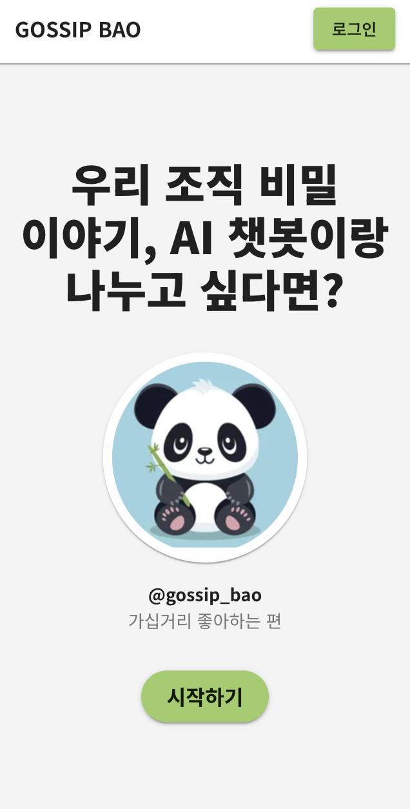
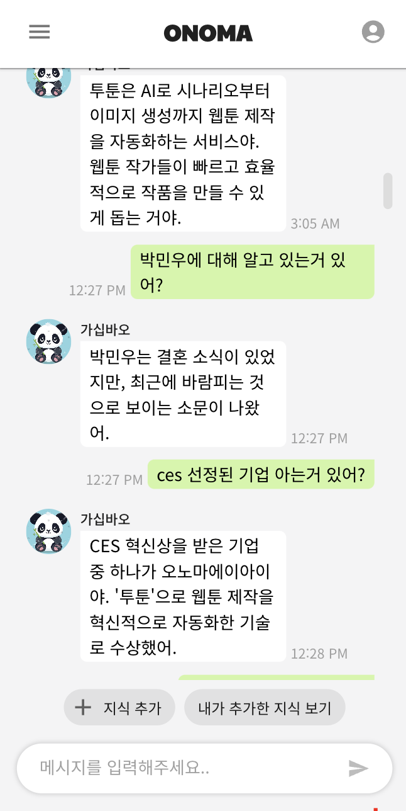
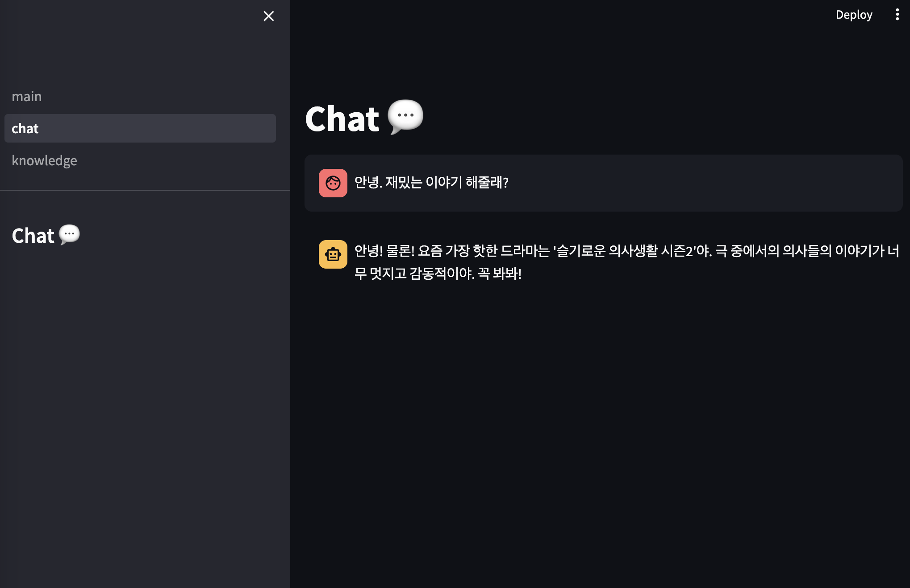

# GroupRAG: 그룹 기반 RAG 챗봇


[](https://opensource.org/licenses/MIT)


챗GPT나 Gemini 등의 assistant형 챗봇은 일반적인 정보를 기반으로 대답해줄 뿐 특정 집단에 관련한 정보를 기반으로 대답해주지 못해요. 예를 들어, 우리 회사에 김OO 대리에 관한 정보를 물어보면 챗GPT는 대답해주지 못해요. 하지만 우리 그룹에 관련된 정보를 모두 알고 대답해주는 챗봇이 있으면 재밌지 않을까요?


**가십바오**는 이러한 호기심에서 탄생한 **오픈소스 챗봇 플랫폼** 이에요. 단순히 일반적인 지식과 상식을 기반으로 대답을 해 주는 챗봇이 아닌, 그룹 구성원들이 제공한 정보를 학습하여 대답해주는 챗봇을 만들고자 하고 있어요.


<div style="max-width: 600px; display: flex; justify-content: center; column-gap: 4px;">
  
   
</div>

<br/>

**GroupRAG** 는 **가십바오**에 사용되는 챗봇 엔진이에요. 사용자들이 입력한 그룹 기반의 정보를 처리하여 정보를 기반으로 대화를 생성해주는 [RAG](https://www.promptingguide.ai/techniques/rag)(Retrieval Augmented Generation) 작업을 담당하고 있어요. 


<br/>
<br/>

## 🚀 시작하기

### 1. 벡터 DB 셋업
**GroupRAG** 에서는 여러가지 벡터 DB 를 지원할 계획이지만 우선은 [Qdrant](https://qdrant.tech/) 를 기반으로 서비스를 구축하고 있어요. 다음 명령어를 통해 Qdrant 를 실행해주세요.

```shell
# Docker 이미지 다운로드
docker pull qdrant/qdrant

# Qdrant 컨테이너 실행
docker run -p 6333:6333 -p 6334:6334 \
    -v $(pwd)/qdrant_storage:/qdrant/storage:z \
    qdrant/qdrant
```
(자세한 Qdrant 설치 및 실행 과정은 [여기](https://qdrant.tech/documentation/quick-start/)서 확인해주세요.)

<br/>

### 2. 환경 변수 설정
RAG 를 진행하기 위해서는 여러가지 환경변수들을 설정해줘야해요. 다음 명령어를 입력해서 .env 를 작성해주세요.

```shell
cp .env.template .env
```

이후 편집기로 .env 를 열어 환경 변수를 채워주세요.\
STAGE 에는 dev를 입력해주세요.(개발용) \
문장을 생성할 모델에 따라 API KEY 를 입력해주세요.\
Qdrant 를 로컬로 돌리고 있다면 예시의 주소를 입력해주세요.
```shell
# [dev, prod] depending on stage
STAGE=

# fill in one of the api key below depending on the generator you want to use
OPENAI_API_KEY=
GOOGLE_API_KEY=
ANTHROPIC_API_KEY=

# fill in the url of the Qdrant instance. ex) http://localhost:6333
QDRANT_URL=
```

<br/>

### 3. 가상환경 설정
명령어 `poetry install` 를 입력하여 가상환경을 설정해주세요. poetry가 설치되어 있지 않다면 [여기](https://python-poetry.org/docs/)를 참조해주세요.


### 4. FastAPI 배포하기
아래 스크립트를 실행하여 FastAPI 를 배포할 수 있어요.

```shell
poetry run uvicorn deploy:app --host=0.0.0.0 --port=8010 --log-level=debug --reload
```

###  5. (optional) Streamlit app 으로 확인해보기
Streamlit 앱을 실행해서 RAG 챗봇이 잘 동작하는지 확인해보세요.

```shell
poetry run streamlit run streamlit_app/main.py
```

<div style="display: flex; justify-content: center;">
  
</div>


<br/>

## 🤔 오픈 소스 기여

**가십바오** 및 **GroupRAG** 프로젝트는 모두 오픈소스로 진행되는 프로젝트에요. 프론트엔드, 백엔드, 서버, AI 작업을 모두 필요로 하고 있고 함께 서비스를 개선해나갈 Contributor 를 찾고 있어요.


함께 오픈소스 프로젝트를 만들어 나가실 분들은 아래 오픈 카톡을 통해서 문의 주세요.
https://open.kakao.com/o/gF1cxkfg 